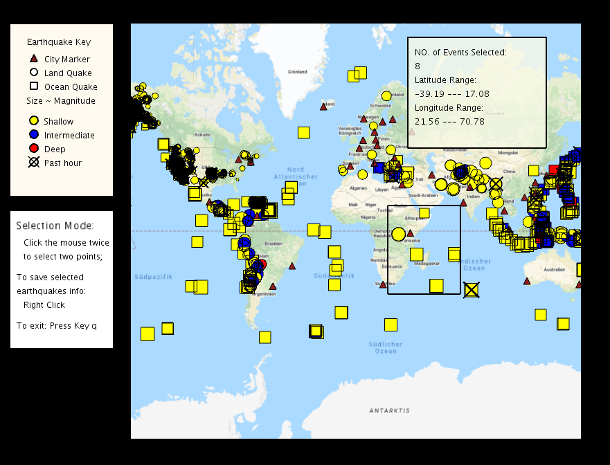

## An interactive map applet for earthquake events
<figure class="image">
    
    <figcaption>An interactive map to display Earthquake events and select earthquake events.</figcaption>
</figure>

Check out the demo video on [Youtube](https://youtu.be/7SvMV3sS3yE).

***
2020/09/20

This is my course work for the Coursera course "Object Oriented Programming in Java".

Some highlights of the work in this repository: </br>

1. Finished all the assignment requirements from module 1 to module 6. Knowledge that has been covered 
includes:

    * Creating GUIs and Displaying Data;
    * Important concepts in Object Oriented Programming: Inheritance, Polymorphism, etc.;
    * GUIs: Responding to User Events;
    * Basic sorting algorithms: Insertion Sort, Selection Sort.


2. From module 1 to module 6, different functionalities are added to make the Java Applet more versatile. 
The Applet will load the earthquake feed from the [USGS website](https://earthquake.usgs.gov/earthquakes/feed/v1.0/atom.php).
In this Applet, it will fetch the earthquakes in the past 7 days and only those with the magnitude larger than 2.5 to exclude very small earthquakes.
    * The map provides a great visualization of the earthquake events;
    * Some useful interactive functionalities, includes:
        1. Hover over the a city marker or an earthquake marker to display addtional information;
        2. Clicking on a marker gives even more information: A click on a city marker will lead to only that city and earthquakes which affect it being displayed on the map. 
        Clicking once again on that marker will bring the rest of the map’s markers back. 
        Similarly, after clicking on an earthquake marker, only cities potentially affected by that earthquake will be displayed.


3. **My own extension to add the Selection functionality**, so the user can draw the box to select a region of interest and save the earthquake information in that selected region. 

All the developed functionalities are integereted in module 6. So you can just go to module 6 and run *EarthquakeCityMap.java*. Have fun!

**Note:** If you being receiving an error like this "java.io.IOException: Server returned HTTP response code: 403 for URL: http://mt1.google.com/..." you may have exceeded the number of allowed queries to Google for the day. Feel free to use an alternative map provider or work offline (by setting ``` offline = true ```) if this happens. 

***
## unfolding_app_template and UC San Diego/Coursera MOOC starter code
This is a skeleton to use Unfolding in Eclipse as well as some starter
code for the Object Oriented Programming in Java course offered by 
UC San Diego through Coursera.

A very basic Unfolding demo you'll find in the source folder in the default package. 
For more examples visit http://unfoldingmaps.org, or download the template with
examples.

The module folders contain the starter code for the programming assignments
associated with the MOOC.

Get excited and make things!


INSTALLATION

Import this folder in Eclipse ('File' -> 'Import' -> 'Existing Projects into
Workspace', Select this folder, 'Finish')


MANUAL INSTALLATION

If the import does not work follow the steps below.

- Create new Java project
- Copy+Paste all files into project
- Add all lib/*.jars to build path
- Set native library location for jogl.jar. Choose appropriate folder for your OS.
- Add data/ as src


TROUBLE SHOOTING

Switch Java Compiler to 1.6 if you get VM problems. (Processing should work with Java 1.6, and 1.7)


